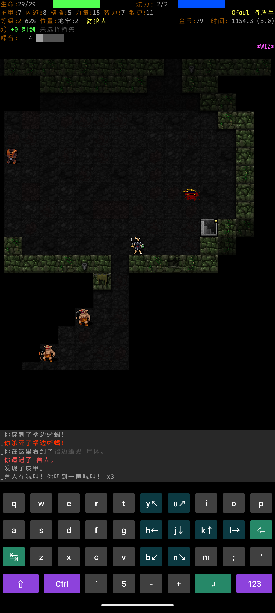
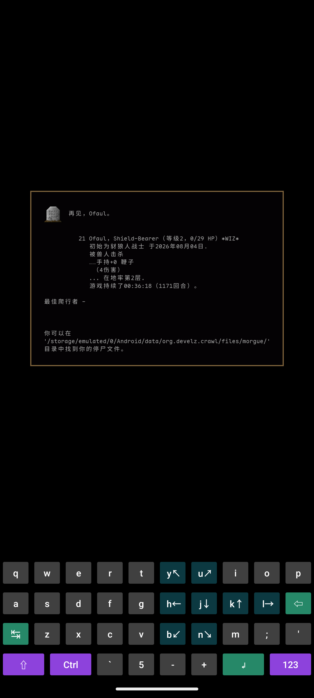
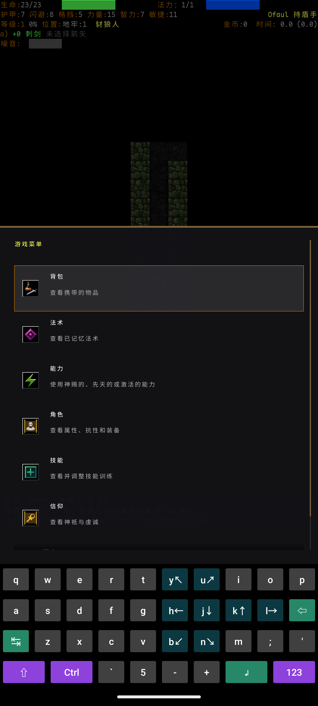
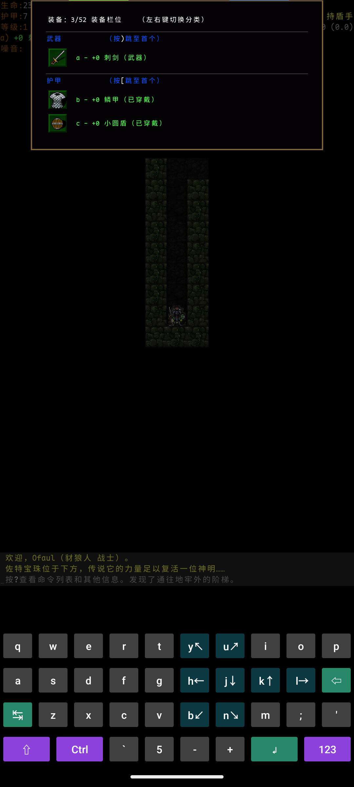
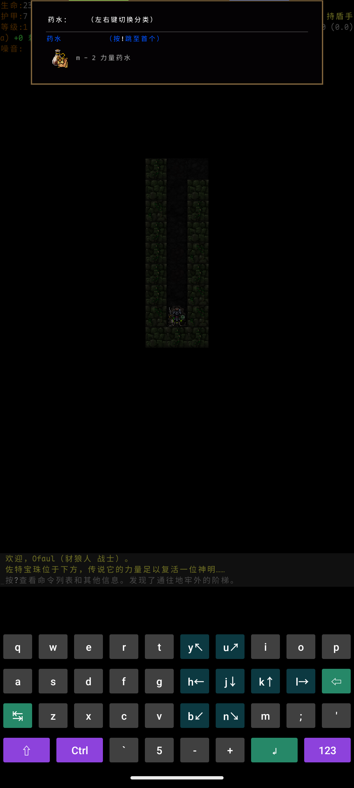
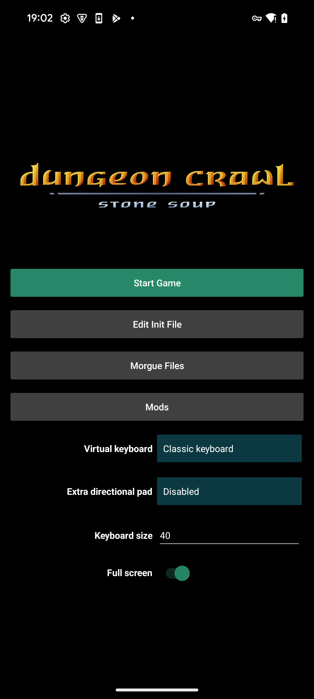
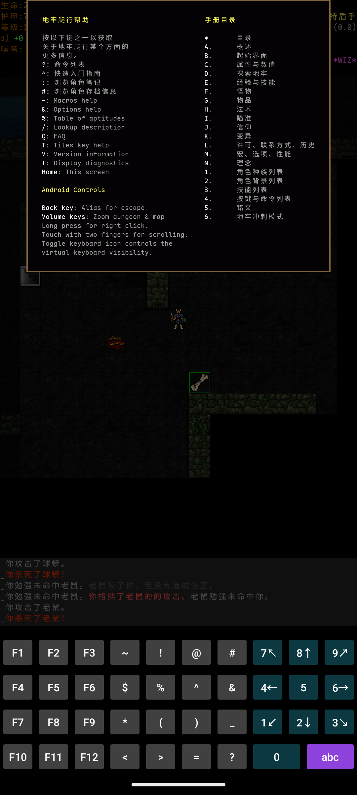
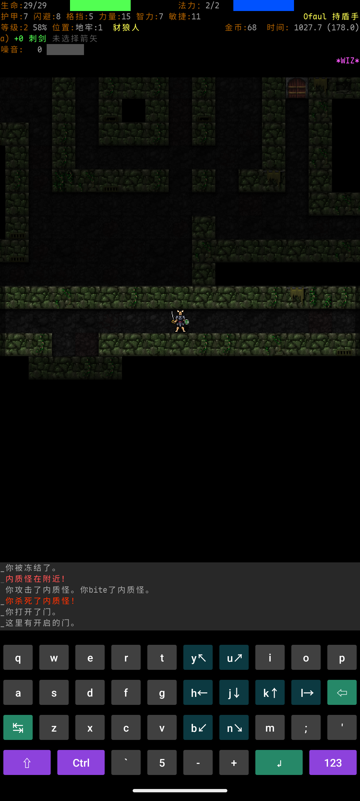

# Android 实机游玩体验与优化报告

日期：2026-08-04  
测试对象：Dungeon Crawl Stone Soup 中文 Android 测试包  
结论类型：单机型、单局、触控优先的探索性实机评测

## 结论摘要

当前 Android 版已经能够稳定完成“开始游戏—探索—战斗—管理物品—进入商店—下楼—死亡结算”的完整循环。在 Pixel 8a 上，画面帧耗时低、冷热恢复稳定，自动探索、地图点按寻路、Android 返回键、音量键缩放和新加入的顶部“游戏菜单”都表现良好。

但它目前更像“把桌面键盘完整搬到手机上”，还不是触控优先的移动端体验。最需要先修复的是一个真实的触控功能阻塞：背包要求用左右方向键切换分类，而虚拟键盘上带箭头的 `h/l` 和 `4/6` 实际发送字母或数字；同一页面只有硬件 DPAD_RIGHT 能切到药水分类。纯触控用户因此无法按界面提示浏览完整背包。

综合判断：

| 维度 | 结论 |
|---|---|
| 核心游戏循环 | 可完成 |
| 触控功能完整性 | 有一项高优先级阻塞 |
| 常用功能可发现性 | 偏低，优秀的顶部菜单没有可见入口 |
| 中文一致性 | 游戏主体较完整，但 Android 外壳、帮助和战斗/战绩仍有明显英文泄漏 |
| 流畅度 | 本机表现优秀 |
| 稳定性 | 本次完整游玩未出现崩溃或 ANR |

建议在下一轮 Android 触控验收前先解决 A-01；之后优先显化现有顶部菜单、加入情境操作，并补齐 Android 专属中文资源。

## 测试环境与方法

### 设备与构建

| 项目 | 实测值 |
|---|---|
| 设备 | Google Pixel 8a，约 7.74 GB RAM |
| Android | Android 15，SDK 35 |
| 屏幕 | 1080 × 2400，420 dpi，竖屏 |
| ADB | 物理设备，序列号已掩码为 `44061…2240` |
| 包名 | `org.develz.crawl` |
| 安装包版本 | `0.34.1-zh5-1-009-14-g63833f68ac`，versionCode `20260804` |
| 源码交叉核对 | 当前 HEAD `695d5fbcd5`；相较安装包提交仅多一个 Android lint 修复提交 |
| 键盘设置 | Classic keyboard，40 dp；Extra directional pad 为 Disabled；全屏开启 |

### 实际游玩范围

- 角色：Ofaul，豺狼人战士，测试包处于 `*WIZ*` 模式。
- 完整一局：D:1 全层探索并下到 D:2，1171 回合，游戏时长 00:36:18，等级 2，最终被手持 `+0 鞭子` 的兽人击杀，得分 21。
- 实际覆盖：冷启动、继续/快速开始、地图点按、八向移动、自动探索、近战、拾取、背包、阅读卷轴、帮助页、商店、楼梯/跨层、顶部游戏菜单、音量键缩放、Android 返回键、前后台恢复、死亡确认、角色档案。
- 输入方式：通过 ADB 向真实设备注入屏幕点击和 Android 按键事件；画面、布局、进程和系统指标均来自设备本身。

ADB 注入能验证真实 Android View、SDL、按键映射和渲染链路，但不能替代真人拇指误触率、握持疲劳、触觉反馈和不同手型测试。因此本报告对触控尺寸提出风险和验收目标，不把它表述为已经测得的人因缺陷。

完整角色档案见[实机 morgue](evidence/android-playtest-2026-08-04/11-morgue-Ofaul-20260804-185946.txt)。

## 一局体验记录

1. 启动与进入游戏：Android 原生启动页很快出现，但所有控件均为英文；点击 `Start Game` 后，地图加载画面在第 6 秒仍可见，在第 12 秒采样时已进入游戏主菜单。
2. D:1 探索：`o` 自动探索稳定，能在物品、门、威胁和地形事件处停下；直接点地图可安全寻路，新敌人出现时会中止。
3. 战斗：虚拟方向键完成八向移动和贴身攻击，战斗过程响应稳定。日志多次出现未翻译的 `bite`。
4. 物品与帮助：背包、物品描述和卷轴确认可用；但背包分类无法靠虚拟左右键切换。`?` 位于 `123` 层，帮助页中的 Android Controls 和多项命令仍为英文。
5. 商店与楼梯：商店列表支持直接点选，余额不足提示清晰；进入商店和下楼仍依赖藏在 `123` 层的 `>`，或熟练玩家才知道的 `G`、`>` 组合。
6. D:2 与死亡：与多名兽人交战后死亡。`*WIZ*` 死亡确认只接受大写 `Y/N`，随后还要经过 `--更多--`、物品页和返回键才能看到战绩。该确认行为属于测试模式，不应直接外推到正式包。

## 表现良好的部分

### 自动探索与地图触控

自动探索是当前移动体验的核心支柱。它显著减少了在 40 dp 小键上连续移动的次数，并会在发现威胁时停下。地图点按寻路同样可用，适合短距离移动和选择目标区域。

### 已有的顶部游戏菜单

点击顶部状态区会打开一个完整的中文触控菜单，包含背包、法术、能力、角色、技能、信仰和更多页面。行高、图标、摘要和滚动区域都明显比虚拟键盘更适合手机。这是当前最值得复用的 Android 机制。

问题不在菜单质量，而在入口不可见：屏幕上没有“菜单”图标、文字或首次提示。完整一局若不知道实现细节，很容易一直把底部键盘当作唯一入口。

### 系统键整合

- Android 返回键能稳定充当 Escape，关闭背包、帮助、描述和抽屉。
- 音量键能缩放地图，并显示“缩放到 1.10”等反馈。
- 从 Home 返回应用的热恢复由系统报告为 32 ms，画面与菜单状态保持正常。

### 流畅度与稳定性

完整一局结束后的 `dumpsys gfxinfo` 快照：

| 指标 | 结果 |
|---|---:|
| 总渲染帧 | 9440 |
| Janky frames | 9，0.10% |
| CPU 帧耗时 P50 / P90 / P95 / P99 | 8 / 9 / 10 / 11 ms |
| GPU 帧耗时 P50 / P90 / P95 / P99 | 2 / 3 / 3 / 4 ms |

本次会话没有新增崩溃、ANR 或 `FATAL EXCEPTION`。这些数字说明 Pixel 8a 上的 Android 框架侧绘制很顺畅，但它们不是端到端 SDL 输入延迟测试；`gfxinfo` 的 High input latency 计数也受回合制等待和 ADB 注入影响，本报告不据此判断输入卡顿。

## 优化发现与优先级

这里的 P0/P1/P2 是产品优化优先级：P0 阻塞纯触控核心路径；P1 明显影响高频操作或新手理解；P2 是质量提升或仍需扩样确认的风险。

### A-01 · P0：虚拟箭头与菜单方向命令不一致

背包标题明确写着“左右键切换分类”。点击虚拟键盘的 `l→` 后页面仍停在装备分类；向设备注入硬件 `DPAD_RIGHT` 后，页面立即切换到药水分类。

| 虚拟 `l→` 后 | 硬件 DPAD_RIGHT 后 |
|---|---|
|  |  |

源码也与实测一致：

- [keyboard_lower.xml](../crawl-ref/source/android-project/app/src/main/res/layout/keyboard_lower.xml) 中 `h/j/k/l` 的箭头只是按钮文字，tag 仍分别是字母 KeyCode。
- [keyboard_numeric.xml](../crawl-ref/source/android-project/app/src/main/res/layout/keyboard_numeric.xml) 的 `4/6` 同样发送数字。
- [DCSSKeyboardBase.java](../crawl-ref/source/android-project/app/src/main/java/org/develz/crawl/DCSSKeyboardBase.java) 会把这些键提交为字符。
- [invent.cc](../crawl-ref/source/invent.cc) 的分页背包只响应 `CMD_MENU_LEFT` / `CMD_MENU_RIGHT`。

建议：让所有“视觉上承诺方向键”的四向按钮在菜单中产生真实方向命令。最小方案是把主键盘的四个带箭头按钮以及 Extra directional pad 的四向按钮路由为 DPAD KeyEvent，同时保留斜向键；若全局映射会影响特定文本输入，再在 SDL/菜单命令层兼容字母与方向命令。

验收标准：

- 不接物理键盘、不使用 ADB keyevent，可在装备、药水、卷轴、可激活物品之间双向循环。
- 同一组键仍能在地牢移动、瞄准、查看模式和菜单焦点中正确工作。
- 对背包、丢弃、拾取、已知物品等使用分页菜单的入口做一次 Android 回归。

### A-02 · P1：顶部游戏菜单优秀但不可发现

现有 [topbar-drawer.cc](../crawl-ref/source/topbar-drawer.cc) 已经提供适合触控的功能入口，因此不需要再造一套导航系统。建议在顶部状态区增加始终可见的“菜单”图标或短标签，并在首次游戏显示一次“点按顶部可打开游戏菜单”的轻量提示。整个状态区继续作为大热区，图标只负责表达可点击性。

验收标准：第一次接触该版本的用户无需查看桌面快捷键帮助，也能从屏幕视觉提示进入背包和角色页；入口不得遮挡生命、法力、状态或 `*WIZ*` 标记。

### A-03 · P1：高频与情境操作仍藏在桌面键盘层级

`?` 和 `>` 都在 `123` 键盘层。站在商店或向下楼梯上时，画面没有直接操作按钮；按 Enter 会得到“未知命令”。熟练玩家可以用 `G` 后接 `>` 自动前往并下楼，但这不是合理的新手触控路径。现有顶部菜单也没有自动探索、进入或上下楼等操作。

建议继续扩展现有顶部菜单，而不是新增常驻大型工具栏：

- 顶部加入“自动探索”。
- 根据脚下地形动态显示“进入商店”“下楼”“上楼”“拾取”等第一项情境操作。
- 在地图上点按商店或楼梯时，至少显示明确的可执行提示；若不会造成误操作，可直接弹出确认或执行。
- 将“命令帮助”保留在更多页，同时在首次提示中说明 `123` 层。

验收标准：纯触控用户从站上商店/楼梯开始，最多两次点击完成进入或跨层；自动探索无需切换键盘层。

### A-04 · P1：Android 外壳与 Android 帮助没有中文资源

原生启动页的 `Start Game`、`Edit Init File`、`Morgue Files`、`Mods`、`Virtual keyboard`、`Extra directional pad`、`Keyboard size`、`Full screen` 全为英文。[strings.xml](../crawl-ref/source/android-project/app/src/main/res/values/strings.xml) 只有默认英文资源，当前没有 `values-zh*` 的 `strings.xml`。

游戏内帮助页也保留 `Macros help`、`Options help`、`Android Controls`、`Back key`、`Volume keys` 等整段英文；对应多行文本位于 [command.cc](../crawl-ref/source/command.cc)，当前 `source.txt` 中没有这些完整键。

建议同时补齐 Android Resource 中文资源与游戏内 Android help 的可翻译键；启动页、编辑器、Mods、morgue 文件管理及确认对话框应作为一个有限清单一次性审计。

验收标准：中文系统语言下，从原生启动页到游戏帮助、文件管理和设置不再出现非专有名词英文；切换到英文系统语言仍使用英文资源。

### ZH-01 · P1：共享游戏文本仍有结构性英文泄漏

战斗日志出现“你 `bite` 了内质怪”“你的 `bite` 未命中……”。[source.txt](../crawl-ref/source/dat/i18n/zh/source.txt) 已经存在 `bite` → `咬`，所以这不是缺词条。安装包对应源码中的 [melee-attack.cc](../crawl-ref/source/melee-attack.cc) 显示，`AuxBite` 继承了返回原始 `name` 的默认实现，而相邻的头槌、啄击等辅助攻击会在 `get_name()` 中调用 `T_()`；这与实机现象相符。

同一份 morgue 还出现：

- `Vanquished Creatures`
- `已消灭21只生物s。`
- 未鉴定物品后的 `{unknown}`
- `你格挡了兽人的的攻击。`
- `兽人它在追击你时发动攻击！`

这些不是 Android 专属问题，但手机狭窄日志会放大中英混排和重复助词的可读性损失。实现修复时应走项目的 translation-pipeline：辅助攻击名先修代码侧翻译边界，morgue/消息模板再按机械扫描结果分别路由，不应仅追加重复词条。

验收标准：以豺狼人尖牙辅助攻击覆盖命中、未命中、零伤害和击杀四条路径；morgue 扫描不再包含上述固定英文或复数后缀残片。

### A-05 · P2：经典键盘密度偏高，常用命令分散

当前每个字母键约 108 × 105 px，即约 41.1 × 40 dp、6.5 × 6.4 mm。键盘高 420 px，占完整屏幕约 17.5%，却仍同时暴露完整字母、Ctrl、Shift、F1–F12 和符号层。它对熟悉 DCSS 的玩家功能完整，但常用的 `o/i/r/x/?/>` 分散在多个位置和层级。

建议保留 Classic keyboard 作为高级模式，再提供一个默认的“移动端紧凑布局”：较大的八向移动、等待、自动探索、菜单、情境操作和一个可展开的完整键盘。单键目标先以至少 48 dp 做版面原型，再通过真人拇指测试决定最终值；不要简单放大现有四行键盘挤压地图。

### A-06 · P2：冷启动地图加载与常驻内存值得扩样

- Android 原生 Launcher Activity 冷启动：213 ms。
- 点击 Start Game 后：第 6 秒截图仍为 `Loading maps...`，第 12 秒截图已到游戏菜单，因此本次端到端样本位于 6–12 秒之间。
- 热恢复：32 ms。
- 冷重启后、游戏引擎菜单处：PSS 约 540 MB，RSS 约 685 MB。
- 长生命周期进程完成一局后：PSS 约 575 MB，RSS 约 720 MB；相差约 35 MB。

单次、不同进程生命周期的内存快照不能证明泄漏，Pixel 8a 的系统内存状态也正常。建议先加分段启动计时，并在 4 GB 设备上做 5 次冷启动和 30 分钟往返楼层/前后台测试；只有确认可复现后再优化资源加载或缓存。

### A-07 · P2：`--更多--` 与结算流程缺少移动端显著性

`--更多--` 只在日志底部显示小号青色文字，连续页面容易让用户误以为界面卡住。死亡和主动放弃后的物品页也没有可见的“继续/返回战绩”按钮，本次必须使用 Android 返回键才能到达最终摘要。

建议把 continuation 转为日志区底部的整行可点“继续”条，并在物品/战绩页提供可见返回动作；保留键盘 Enter/Escape 兼容桌面操作。

## 建议实施顺序

### 下一测试包前

1. 修复 A-01 虚拟方向键语义，并完成分页菜单回归。
2. 修复 `bite` 的代码侧翻译边界，加入辅助攻击消息测试。

### 第一轮移动体验优化

1. 显化现有顶部游戏菜单入口。
2. 在该菜单中加入自动探索和情境操作。
3. 补齐 Android Resource 与 Android Controls 中文资源。

### 后续质量提升

1. 原型化移动端紧凑键盘，并进行真人拇指测试。
2. 改善 `--更多--`、死亡和放弃流程。
3. 扩展低内存设备、横屏、不同 dpi、系统字体缩放和长时前后台测试。

## 下一轮实机验收清单

- 仅用屏幕触控，从原生启动页开始一局。
- 从可见菜单进入背包，并切遍四个分类。
- 自动探索、地图点按、八向战斗和查看模式均正常。
- 一次点击可发现情境操作，两次内进入商店或上下楼。
- 帮助、启动页、设置、战斗日志和 morgue 不出现已知英文泄漏。
- Home 后热恢复保持当前状态；返回键逐层关闭界面，不误退出游戏。
- 在至少一台 4 GB 设备上复测冷启动、30 分钟内存趋势和系统回收后的恢复。
- 记录 framework 帧耗时之外的端到端触控延迟与真人误触率。

## 证据索引

| 证据 | 文件 |
|---|---|
| D:2 实战 | [01-d2-combat.png](evidence/android-playtest-2026-08-04/01-d2-combat.png) |
| 死亡摘要 | [02-death-summary.png](evidence/android-playtest-2026-08-04/02-death-summary.png) |
| Android 英文启动页 | [03-native-launcher-english.png](evidence/android-playtest-2026-08-04/03-native-launcher-english.png) |
| 中英混合帮助页 | [04-help-mixed-language.png](evidence/android-playtest-2026-08-04/04-help-mixed-language.png) |
| 顶部游戏菜单 | [05-command-drawer.png](evidence/android-playtest-2026-08-04/05-command-drawer.png) |
| 虚拟右键未切分类 | [06-inventory-soft-right.png](evidence/android-playtest-2026-08-04/06-inventory-soft-right.png) |
| 硬件 DPAD 切到药水 | [07-inventory-dpad-right.png](evidence/android-playtest-2026-08-04/07-inventory-dpad-right.png) |
| `bite` 泄漏 | [08-bite-leak.png](evidence/android-playtest-2026-08-04/08-bite-leak.png) |
| 商店触控 | [09-shop-menu.png](evidence/android-playtest-2026-08-04/09-shop-menu.png) |
| 音量键缩放 | [10-volume-zoom.png](evidence/android-playtest-2026-08-04/10-volume-zoom.png) |
| 完整角色档案 | [11-morgue-Ofaul-20260804-185946.txt](evidence/android-playtest-2026-08-04/11-morgue-Ofaul-20260804-185946.txt) |

## 限制与术语上下文

- 只有一台较新、8 GB 内存的 Pixel 设备、一个竖屏分辨率和一局完整样本；未覆盖横屏、折叠屏、低端 GPU、低内存杀进程、蓝牙键盘、TalkBack 或真人手指误触统计。
- 安装包是 `*WIZ*` 测试构建，且角色档案记录过多次开发包升级；正式发布包仍需独立复测死亡确认、存档迁移和无调试能力路径。
- 本报告没有修改游戏代码或翻译资产。
- 按仓库要求，本次中文体验审查在当前工作树解析术语上下文；`docs/glossary.md` SHA-256 为 `95eeacf9704e046c2010ef34859b750d2f8a1937ad87c4a86e8a404c98689407`。
