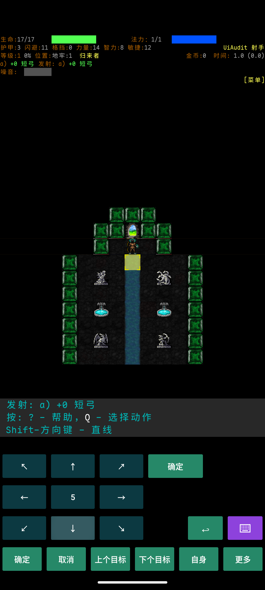
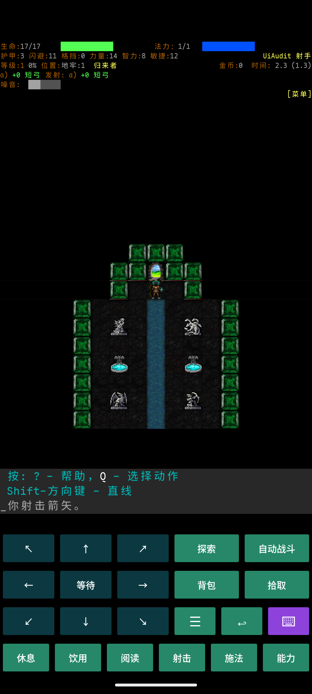
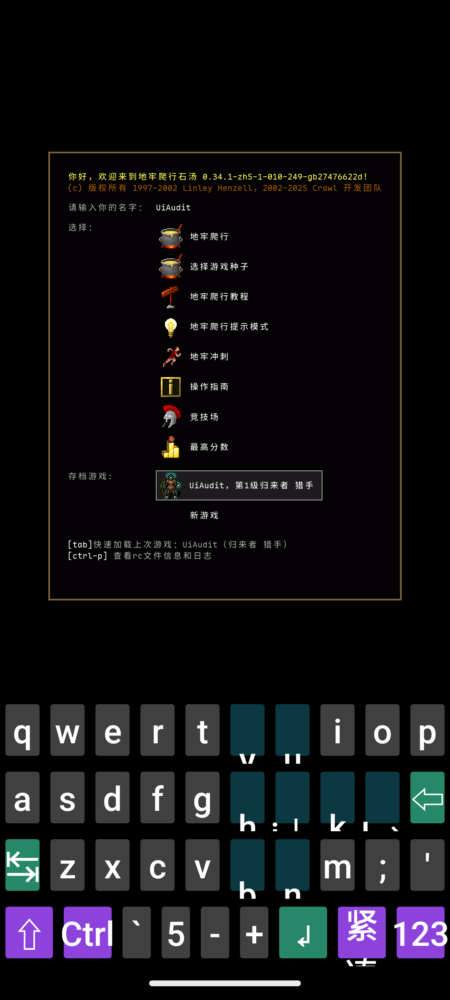
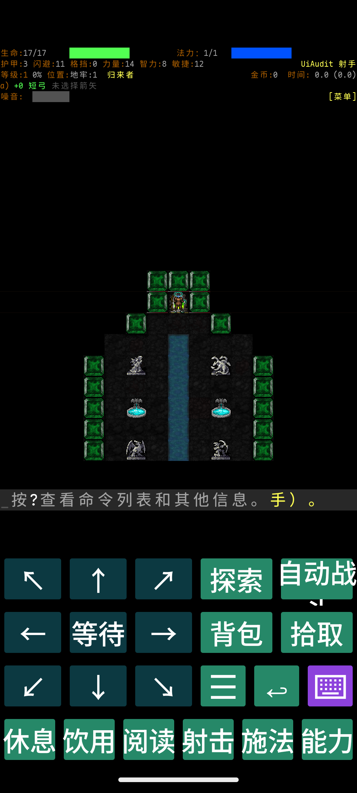
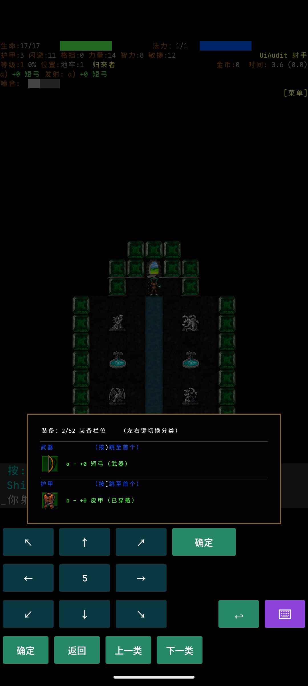
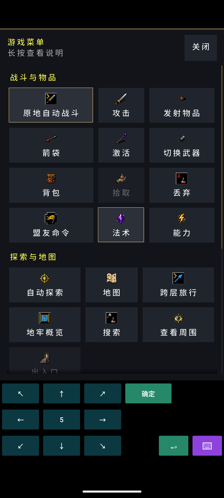

# Android UI 与操作优化方案报告

日期：2026-09-22

源码基线：`b27476622deb59cf5e8b39102845232464dcc846`

交付范围：现状分析、模拟器验证与优化方案；未修改游戏实现。

当前版本已经具备紧凑键盘、情境操作、中文游戏菜单和高级操作溢出入口。下一轮最有价值的工作是**修复误触执行与静默失败，统一大字号和列表体验，再提高信息与设置的可发现性**。本次确认了四项具体问题：瞄准时点击 HUD 或长按地图会直接射击；200% 字号导致键盘文字裁切；含中文配置原样保存会新增 NUL；空箭袋时“射击”无操作也无解释。

## 1. 代码与测试基线

已执行 `git fetch origin` 和 `git pull --ff-only origin chn-0.34.1-base`，结果为 Already up to date，HEAD 与远端分支一致。工作区原有的 `.pi/agents/` 修改及 `addons/` 未参与分析、未被覆盖。

| 项目 | 本次使用的基线 |
|---|---|
| 安装包来源 | [GitHub Actions Build 35660170793](https://github.com/yutio8888/crawl-chn-ai-test/actions/runs/35660170793)，2026-09-21，成功；artifact `android-debug-apk` |
| 构建身份 | `0.34.1-zh5-1-010-249-gb27476622d`，versionCode `416`，与当前 HEAD 对应 |
| APK SHA-256 | `2f74dd314c493c9d545b48524b5c989d1c5cf658f692caae1fa49641faff3329` |
| 模拟器 | 本次新建的独立 AVD，Pixel 7 配置，Android 15 / API 35，x86_64，2 GB RAM、2 核 |
| 屏幕 | 1080 × 2400；标准 420 dpi，宽约 411dp；窄屏使用 540 dpi，宽 320dp |
| 字号与语言 | 标准 100%；另测 320dp / 200%；应用语言设为 `zh-CN` |
| 操作方式 | ADB 注入点击、长按和少量准备用按键；截图、UI 层级、文件字节对比与源码交叉验证 |
| 测试角色 | 新建 UiAudit，归来者猎手，D:1，普通游戏，未开启巫师模式 |

并行只读审计分别覆盖 Android Java/XML 外壳和 C++ 界面/输入链路，主线程完成设备验证及报告归并。使用现成 CI 包，没有为报告重编译或重跑整套验证。

初始 `swiftshader_indirect` 和 `swiftshader` 后端在进入地牢时导致**宿主 emulator 进程**以 139 退出；改用 `swangle` 并关闭 Vulkan 后完成本报告的游戏内测试。这些失败属于本轮环境记录，不能据此认定 APK 崩溃，也不能用本模拟器推断真机帧率、启动性能或耗电。

### 实际覆盖

| 场景 | 结果与边界 |
|---|---|
| 启动页、折叠设置、配置编辑 | 已测；RC 读写问题完成字节级复现 |
| 新角色与读档、紧凑/完整键盘 | 已进入游戏并读回本次角色；覆盖 200% 字号显示 |
| 八向键中的移动、等待区及菜单入口 | 完成部分操作；未宣称穷尽所有方向和组合键 |
| 背包左右分类 | 触屏右键从装备切至卷轴，左键返回装备，旧阻塞本次未重现 |
| 箭袋选择与射击 | 已验证空箭袋静默、选择短弓后进入 TARGET，以及两种误确认 |
| 游戏菜单与搜索 | 已打开中文菜单和搜索提示；默认模式只出现自制字母盘 |
| 多状态、多法术/能力、箭袋全部类别同时存在 | 本轮只读代码验证，未构造完整局面 |
| 商店、长局战斗、死亡流程、TalkBack、真机手势与低端机性能 | 本轮未测；相关建议附后续验收，不写成已通过或已发生故障 |

## 2. 已有改进应继续复用

不能继续沿用 2026-08-04 报告的“只有桌面键盘”判断。当前已具备：

- 手机默认紧凑布局、核心键高至少 48dp、明确的菜单/返回/键盘入口。
- GAME 第四行情境操作，以及背包分类、地图、瞄准、物品和技能等页面的专用操作。
- 分组中文菜单、滚动、长按说明、部分动作不可用原因、地图与瞄准的“更多”。
- Android 中文资源、可滚动的折叠设置和键盘大小校验。
- 系统返回键、文本场景自动展开完整布局、字号变化处理及已有存档保护。

当前背包分类触屏证据见[右切](evidence/android-ui-audit-2026-09-22/11-inventory-right.png)和[左切](evidence/android-ui-audit-2026-09-22/12-inventory-left.png)。其他历史验收可参考 [P3 验证记录](android-shortcut-p3-verification.md)，但其旧候选的通过结果不能替代本次未覆盖场景。

横屏当前按产品安排锁定，相关 [Issue #113](https://github.com/yutio8888/crawl-chn-ai-test/issues/113) 已延期；本方案围绕竖屏推进，不自动恢复该项投入。关闭背包后重新打开从顶部开始，也是既有明确接受的行为，不列为新缺陷。

## 3. 优先级总览

P1 为应优先处理的操作错误、明确可读性问题或高频路径缺口；P2 为体验提升。优先级不等于证明强度：“实测”是本轮最新包观察，“代码”是条件性实现事实，“建议”需要设计与用户测试。工作量 S/M 仅表示局部修改/跨层联动的相对大小，不是工期承诺。

| 编号 | 优先级 | 优化点 | 证据 | 工作量 |
|---|---|---|---|---|
| A01 | P1 | 瞄准只接受有效地图左键确认，过滤 HUD 点击与长按 | 实测＋代码 | S–M |
| A02 | P1 | 修复大字号键盘裁切，保持可读性与稳定布局 | 实测＋代码 | M |
| A03 | P1 | 修复配置编辑 UTF-8 往返，并保护未保存内容 | 实测＋代码；丢弃提示为建议 | S |
| A04 | P1 | 空箭袋射击给出原因和下一步入口 | 实测＋代码 | S |
| A05 | P1 | 统一旧列表的字体与触控尺寸 | 截图＋代码；尺寸方案需验收 | M |
| A06 | P2 | 文本场景可临时调用系统输入法 | 实测现状＋代码＋建议 | M |
| A07 | P2 | 状态溢出提示及更大的状态入口 | 代码＋建议 | S–M |
| A08 | P2 | 快捷栏、箭袋动作完整呈现“更多” | 代码＋建议 | S–M |
| A09 | P2 | 消息区就地回看，明确继续/跳过语义 | 代码＋建议 | S–M |
| A10 | P2 | 设置增加单位、尺寸预设和效果预览 | 实测现状＋建议 | S |

## 4. 优化设计与验收

### A01：先消除瞄准中的意外执行

**复现。** 装备短弓并在箭袋指定短弓后，点击“射击”，再用虚拟下方向键将目标移到下方空地：

1. 点击顶部 HUD 的 `(200,160)`，未点击地图或“确定”，角色仍发射箭矢；时间从 `1.0` 增至 `2.3`，退出瞄准。
2. 再次进入瞄准并选下方空地，对地图 `(535,1060)` 长按 900ms，也发射箭矢；时间从 `2.3` 增至 `3.6`。

| HUD 点击前 | HUD 点击后 |
|---|---|
|  |  |

长按另有[之前](evidence/android-ui-audit-2026-09-22/06-target-before-longpress.png)与[之后](evidence/android-ui-audit-2026-09-22/07-target-after-longpress.png)截图。这里的 1.3 是游戏显示的行动时间增量，不是现实输入延迟。

**原因。** [directn.cc](../crawl-ref/source/directn.cc) 第 2541–2548 行对 `MouseDown` 统一发出 `CMD_TARGET_MOUSE_SELECT`，未按按钮和有效地图命中区过滤；第 2374–2376 行继续执行目标确认。[SDLActivity.java](../crawl-ref/source/android-project/app/src/main/java/org/libsdl/app/SDLActivity.java) 第 1758–1763 行把长按转成右键，两条路径由此汇合。

**方案。** 在现有目标选择事件入口验证按钮、区域与有效格子；只有有效地图左键点击能够走当前点击确认。HUD、消息区、边距及无效地图坐标不提交目标。右键/长按与确认分开，沿用查看能力或保持选择状态。保留现有射程、自伤和友军保护。

**验收。** 分别点击 HUD、消息区、地图边距及长按目标，回合、法力和弹药均不变化；有效地图点按及显式“确定”仍正常；取消、目标循环、更多中的强制确认仍遵守原有规则。用射击、投掷、定向法术各覆盖一次。是否采用“首次点选预览、再次确认”可另做交互试验，不作为本次事件过滤修复的前提。

### A02：大字号必须完成排版，而不只是放大字形

**复现。** 1080px 宽、540dpi 即 320dp，系统字号 200%：完整键盘中的带箭头字母、紧凑切换文字出现跨行裁切；紧凑模式“自动战斗”也被截断。截图和 [UI 层级](evidence/android-ui-audit-2026-09-22/compact-320dp-200.xml) 显示每键仍高 162px，即 48dp。

| 完整键盘 | 紧凑键盘 |
|---|---|
|  |  |

**原因。** [DCSSKeyboard.java](../crawl-ref/source/android-project/app/src/main/java/org/develz/crawl/DCSSKeyboard.java) 第 325–340 行按固定键高保留四行空间；[DCSSKeyboardBase.java](../crawl-ref/source/android-project/app/src/main/java/org/develz/crawl/DCSSKeyboardBase.java) 第 87–95 行与相关配置刷新处理未保证放大后的文字实际布局可容纳。已有配置测试检查字号、可见性和高度，不能证明文字没有裁剪。

**方案。** 每次屏幕/字号配置确定后，结合文字行高、内边距和可用宽度计算布局，再保持该配置下情境切换的几何稳定。优先为高频触控按钮保留完整名称和足够热区；必要时将低频动作移入已有“更多”。完整字母盘需单独处理双符号标签与换行，文本任务结合 A06 使用系统输入法。不能用无条件缩小文字抵消用户的大字号选择，也不能把十列字母盘的每键都机械设成 48dp 宽。

**验收。** 320/360/411dp × 100/130/200%，覆盖 GAME、MENU、TARGET、MAP、TEXT、数字盘和完整盘；文字无越界、按钮不互相遮挡，移动/取消/确认可达，核心触控按钮至少 48dp，情境切换不反复改变 SDL 尺寸。200% 是 Android 14 起需要认真覆盖的字号能力，参考 [Android 字号缩放说明](https://developer.android.com/about/versions/14/features#non-linear-font-scaling)。

### A03：配置编辑原样保存应保持文件内容

**复现。** 在独立测试安装中，将 `init.txt` 设为以下内容，进入“高级 → 编辑初始设置”，不做修改直接保存：

```text
# 中文
language = zh
```

原文件为 23 字节、0 个 NUL；保存后为 27 字节，末尾新增 4 个 `00` 字节。完整对比见 [rc-roundtrip.txt](evidence/android-ui-audit-2026-09-22/rc-roundtrip.txt)。测试后已恢复该安装的原配置。

**原因。** [DCSSTextBase.java](../crawl-ref/source/android-project/app/src/main/java/org/develz/crawl/DCSSTextBase.java) 第 39–44 行以文件字节数分配字符缓冲，读取后 `rewind()` 保留容量作为 limit，UTF-8 多字节字符留下的未填充区域进入文本；第 56–59 行将其写回。本次证明文件被改变，未进一步证明这段尾部内容必然导致所有配置加载失败。

**方案。** 循环读取至 EOF，并只传递实际字符；显式使用 UTF-8。保存采用临时文件写完再替换，失败保留原文件。顺带为编辑器增加 dirty 状态，系统返回/取消时对未保存更改提供继续编辑与明确放弃；不改动时直接关闭。

**验收。** 空文件、ASCII、混合中文、多行及较长配置原样保存逐字节一致，没有新增 NUL；修改后退出不无声丢失；写失败保留原文件及可继续编辑的内容。扩展现有 `DCSSTextEditorTest`/文件读写测试即可，不需要新建配置管理系统。

### A04：不能让可见“射击”按钮无声失效

**复现。** 本次测试角色持有短弓，但箭袋为空时，绿色“射击”与硬件 `f` 均返回 GAME，没有射击、目标选择或新的解释。经 `Q` 进入现有箭袋菜单选择短弓后，同一按钮正常进入瞄准。因此不能将它归因于触控按键未送达。

这一静默行为在 [P1 既有验收记录](android-shortcut-p1-verification.md) 中已有观察，本次确认它在最新包仍然存在，不是认定当前提交新引入了故障。

**原因。** [main.cc](../crawl-ref/source/main.cc) 第 2266 行进入 `quiver_action.target()`；[quiver.cc](../crawl-ref/source/quiver.cc) 第 2882–2895 行继续进入动作流程，空动作的非定向路径由 [throw.cc](../crawl-ref/source/throw.cc) 第 116–121 行置无效后返回，没有失败消息。GAME 描述符只判断键位，Java 只按键值和标签启用按钮。

**方案。** 在原生命令入口或 `action_cycler::target()` 区分“尚未指定动作”和“完全没有候选”，给出原因，并引导已有 `quiver::choose()`。优先消除静默，再考虑按钮状态；Java 不复制游戏的能力/资源规则。空动作的 `is_valid()` 仍为 true，应使用已有 `is_empty()` 判断。

**验收。** 持弓但未指定、手动清空、没有候选三种情况均有准确反馈且不耗回合；触屏和实体键盘一致；指定动作后正常瞄准。抽屉中“没有可放入箭袋的东西”所对应的判断不能直接套用到“已有短弓但未指定”。

### A05：旧列表与新菜单采用一致的可读性和触控基线

**现状。** 新菜单的大按钮与背包旧式列表在字号、行距上有明显差异：

| 当前背包 | 当前游戏菜单 |
|---|---|
|  |  |

[menu.cc](../crawl-ref/source/menu.cc) 第 115、214、382–485 行使用 CRT 字体、32 个游戏像素图标和固定 padding 推导行高，缺少 Android 触控最小尺寸约束。[tilesdl.cc](../crawl-ref/source/tilesdl.cc) 第 318–343 行的自动字体下限只覆盖消息、提示和标签，保留 CRT/HUD 原有算法；Android 系统字号并未统一作用于这些 C++ 文本。截图能证明显示差异，尚未测得真人误触率。

**方案。** 扩展现有 `UIMenu`，为 Android 的可选条目设置最小整行热区，分开处理文字大小、图标和行间距；长列表继续滚动，长名称换行，不直接把旧定列界面的字体全部放大。字体设置可先覆盖列表、描述和消息，HUD 保持重点信息优先。原生角色档案/Mod 列表同样补齐行高与选中语义，其 XML 目前也缺少最小行高。

**验收。** 背包、拾取、丢弃、商店、箭袋、技能及原生文件列表在窄屏和大字号下可完整读取、单击选择、单指滚动；滚动不触发条目；数量输入、多选、分类和详情返回保持正确。核心列表整行热区以至少 48dp 为目标，依据 [Android 触控目标建议](https://developer.android.com/guide/topics/ui/accessibility/apps)。

### A06：让文本场景使用合适的输入工具

**现状。** 从菜单进入搜索后自动出现自制字母盘，系统 IME 未显示，见[截图](evidence/android-ui-audit-2026-09-22/10-search-text.png)及 [IME 状态](evidence/android-ui-audit-2026-09-22/search-ime.txt)。[DCSSKeyboard.java](../crawl-ref/source/android-project/app/src/main/java/org/develz/crawl/DCSSKeyboard.java) 第 555–557 行仅切换完整盘；[SDLActivity.java](../crawl-ref/source/android-project/app/src/main/java/org/libsdl/app/SDLActivity.java) 第 1837–1846 行只有全局系统键盘模式才能聚焦 IME。

**方案。** 在 TEXT 场景提供“系统键盘”入口，临时使用已有 `DummyEdit`/IME 通路；结束文本输入后恢复先前紧凑布局。数字场景提供数字输入类型。保留完整盘用于快捷键与高级输入，不要求玩家退出游戏修改全局键盘模式。

**验收。** 默认紧凑模式下完成中文输入、候选提交、删除、粘贴和取消；退出后方向键恢复，菜单命令不被候选栏吞掉。分别核对取名、铭刻和搜索实际支持的字符及检索规则；“能输入中文”不自动等于“中文搜索匹配已经正确”。本次未安装中文 IME 验证完整合成输入链路。

### A07：状态溢出必须有可见提示

**代码事实。** [output.cc](../crawl-ref/source/output.cc) 第 1471–1484 行在一行状态放不下时停止输出，没有剩余数量标记。重要状态已有优先序，不能描述为完全随机。[tilereg-stat.cc](../crawl-ref/source/tilereg-stat.cc) 第 84–94 行只有精确状态文字命中才打开状态抽屉，附近空白进入通用菜单。完整状态列表已经存在于 [topbar-drawer.cc](../crawl-ref/source/topbar-drawer.cc) 第 114–167 行。

**方案。** 预留“全部状态/+N”入口，扩大状态组热区，点击后复用完整状态抽屉；继续优先显示重要负面状态。避免新增第二套状态详情页。

**验收。** 多状态、长名称和320dp宽度下，完整列表无遗漏；有隐藏状态时显示溢出提示；热区随状态刷新，不残留旧位置；打开详情不耗回合。本轮未构造多状态局面，属于代码证实的可发现性缺口。

### A08：补齐已有“更多”机制的最后几处缺口

**代码事实。** 两类快捷项同时存在时，[tilesdl.cc](../crawl-ref/source/tilesdl.cc) 第 1328–1346 行将法术与能力各分一半宽度，超出容量直接截断；第 999–1019 行在高度不足时隐藏整行。菜单末尾已有完整列表，但快捷栏自身没有溢出说明。

另外，[quiver.cc](../crawl-ref/source/quiver.cc) 第 2766–2778 行固定六槽：同时有物品、法术、能力并允许清空时，“清空”因没有剩余槽位而不显示。底层清空命令仍存在，该页面未覆盖 `keyboard_more()`，所以这是紧凑入口缺口，并非彻底不能清空。

**方案。** 快捷栏提供“全部”入口，直达现有完整列表；空间允许时让条目少的一类让出空位。箭袋直接复用 `ui::spill_input_actions()` 和 `Menu::keyboard_more()`。先完成入口和溢出一致性，再考虑可选的常用项排序；暂不引入持久自定义快捷栏框架。

**验收。** 1 个法术＋多个能力、多个法术＋1 个能力、两类均溢出、整行因高度隐藏时，全部动作仍有可见路径；箭袋三类齐全时清空可达，取消不改变箭袋，清空不误执行动作。本轮未完整构造这些组合。

### A09：把消息回看放到消息附近

**代码事实。** [tilereg-msg.cc](../crawl-ref/source/tilereg-msg.cc) 第 22–25 行对 overlay 消息区点击直接不处理；消息历史存在于通用菜单。MORE 已有继续操作，但 [message.cc](../crawl-ref/source/message.cc) 第 2030–2036 行的 Escape 会设置当前批次自动清除，语义比普通“关闭当前页”更强。

**方案。** 在消息区提供明确、不会穿透地图的历史/展开入口，复用 `CMD_REPLAY_MESSAGES`；新消息与待确认消息的可见状态保持清楚。MORE 的继续与批量跳过分别评估，先补充说明和实测，不直接取消既有危险提示。

**验收。** 密集战斗记录、长消息、普通/强制 MORE、历史返回均覆盖；查看历史不耗回合、不触发地牢动作；手机返回键行为与显示说明一致。这里提出的是入口与语义优化，本轮未证明玩家实际漏读危险消息。

### A10：设置让玩家看得懂、调得准

**现状。** [当前设置截图](evidence/android-ui-audit-2026-09-22/01-settings.png) 只有“键盘大小”数字；[DCSSLauncher.java](../crawl-ref/source/android-project/app/src/main/java/org/develz/crawl/DCSSLauncher.java) 第 337–371 行虽已夹紧输入，但页面没有单位、范围、紧凑模式下限解释或效果预览。

**方案。** 扩展现有“输入与显示”组，加入小/标准/大尺寸预设和占屏预览；高级数值保留，标出 dp 和允许范围；数值被调整时说明实际采用值。将 A05 的阅读字号设置纳入同一组，区分地图缩放、文字大小、按键高度三件事。

**验收。** 玩家无需编辑 RC 即可调整常用阅读/操作尺寸；预览与实际一致；320dp大字号可滚动到全部设置；焦点提交、IME Done、点击开始时的现有提交保护不退化。

## 5. 需要专项验证的风险

这些项目不应与已复现故障混在一起，但实现相关改动时应优先补测。

| 风险 | 代码依据 | 最小验证与可能处理 |
|---|---|---|
| 长按自动战斗离开按钮/失焦后的停止边界 | `DCSSKeyboard.java:279–320` 主要在 UP/CANCEL/detach 停止，未显式处理 MOVE 越界及 Activity 暂停 | 长按后滑出、Home、下拉通知、熄屏、切菜单；确认不再发键、恢复不补发。若失败，复用 `stopAutofightRepeat()` 补取消边界。当前不能宣称后台会继续攻击 |
| 导出文件时 Activity 重建 | `DCSSTextBase.java:28,84–108` 将导出来源只保留为 View 字段；Mod 导出还依赖当前选择 | 在系统文件选择器期间重建调用方 Activity，再返回；从保存的文件/资产身份恢复内容，检查空流与取消。未设备复现崩溃 |
| 缩放反馈与实际格子上限不一致 | `tilesdl.cc:1480–1488` 用整体高度估算缩放上限，`:1044–1049` 布局再扣 HUD/消息等空间 | 在短竖屏和大按键配置连续放大，对比实际格子像素；必要时共用有效地牢尺寸预算并显示达到上限。未量测证明本轮发生 |

完整游戏的 TalkBack 支持还需要 SDL/C++ 内容语义，不能仅凭原生按钮已有描述就宣称无障碍完成。近期可先验收原生文件列表选中状态、错误公告和核心按钮焦点；完整游戏朗读属于更大的后续范围。

## 6. 建议实施顺序

| 批次 | 内容 | 完成标准与依赖 |
|---|---|---|
| 第一批：操作与数据正确性 | A01、A03、A04；A02可并行进行设计和复现固化 | HUD/长按不误射；配置无损往返；空动作明确反馈。优先使用局部修复，各自可独立交付 |
| 第二批：阅读与输入一致性 | A02、A05、A06 | 同一批定义字体/热区策略，再接入临时 IME；覆盖大字号实际像素布局与文本合成，不只断言控件存在 |
| 第三批：发现性与设置 | A07–A10 | 复用现有抽屉、更多、消息历史和折叠设置；所有隐藏动作均有可见入口 |

修改时继续沿用既有 JNI 输入桥、C++ 命令规则、`UIMenu`、抽屉和情境键盘。交互描述中的中文名称只是方案说明，正式新增/修改游戏文案时再按项目流程解析术语、分配翻译资产所有者。

实现验证应扩展现有 Android 配置/编辑器测试和输入专项测试；C++/i18n 代码变更使用项目匹配的隔离 `code` profile。本报告只做审计，不把 CI 原有通过状态写成上述未来改动已经验证。

## 7. 后续体验验收矩阵

| 维度 | 建议覆盖 | 可观察的通过条件 |
|---|---|---|
| 视口与字号 | 320/360/411dp；100/130/200%；一台较短竖屏 | 关键文字完整；核心触点不重叠；取消/确认始终可达 |
| 输入模式 | 默认紧凑、手动完整、临时系统IME、实体键盘 | 同一命令语义一致，退出文本输入恢复原模式 |
| 操作正确性 | 点击、长按、滑出、滚动、返回、提示出现 | 不意外耗回合/资源；拒绝操作有原因；滚动不选中条目 |
| 核心流程 | 背包分类/多选、商店、地图、目标选择、法术/能力、消息历史 | 高频动作直接可达，低频动作经已有“更多”可达，无静默遗漏 |
| 生命周期与文件 | Home/通知/熄屏/重建、RC读写、文件导出 | 无补发输入；文件无损；失败保留内容和恢复路径 |
| 真人体验 | 至少覆盖新玩家、熟悉快捷键的玩家和大字号使用者 | 记录寻找入口耗时、误触次数、任务完成率；与当前包做同任务对比，不以ADB成功代替手持体验 |
